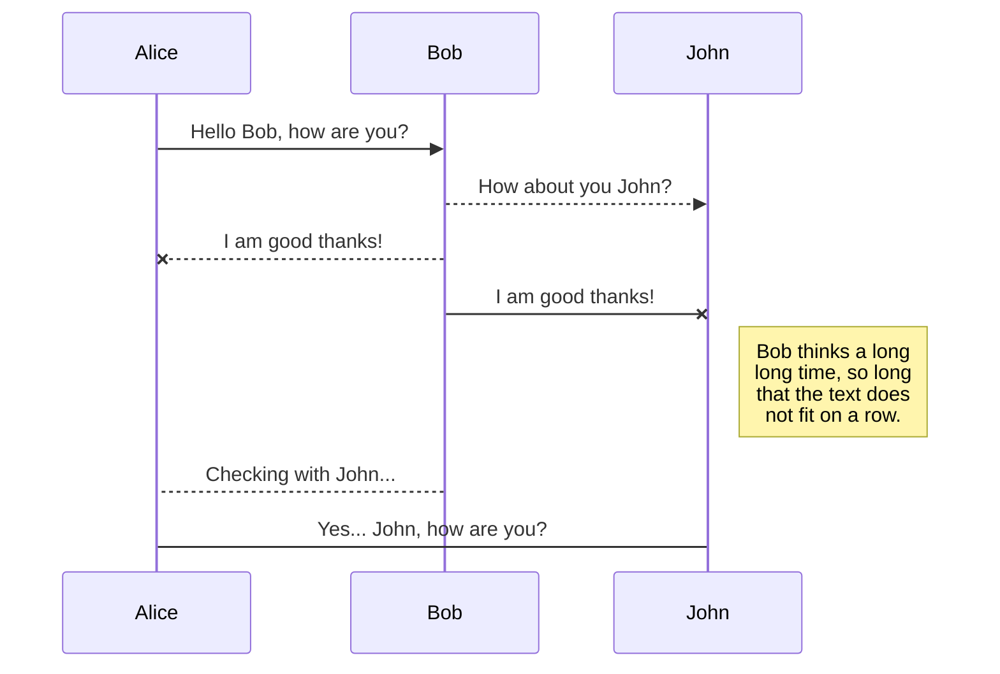
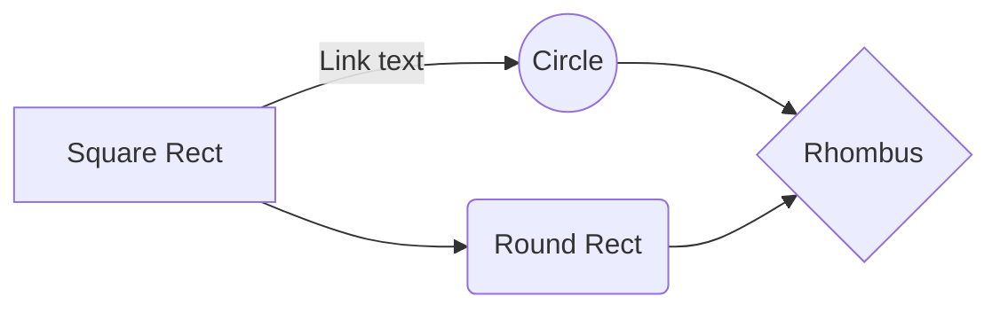

# GPT-2 writing comedy sitcom?

Hi! This is a first experiment to see if a state-of-the-art language model such as [GPT-2]() can learn to write comedy sitcom in the course of one night.  I thought we might as well let the [transformer]() learn from the best and start it off with the finest material.  [**Seinfeld**](https://www.imdb.com/title/tt0098904/) is my all time favorite comedy show on TV, that's what I'll go with!  


## The training (fine-tuning) data

I scraped all the Seinfeld scripts from http://www.seinology.com a couple years ago - this site actually doesn’t exist anymore.  Each episode is one text file, I concatenated them with '<|endoftext|>' added to the end of each episode and stripped out excess `\t` and `\n` characters. Pretty minimal cleaning. This generated ~4.5MB of text.

**Data hosted [here](https://raw.githubusercontent.com/LanGuo/seinfeldNLP/master/all_scripts.txt).**

## Getting started – installation in a Python virtual environment
The GPT-2 fine-tuning and text generation was made super straightforward by the good folks at [Hugging Face](https://github.com/huggingface).  We'll start by cloning their transformers [repo](https://github.com/huggingface/transformers) into a fresh virtual environment and installing other dependencies.
```
python3 -m venv huggingface

source huggingface/bin/activate

mkdir src

cd src/

git clone https://github.com/huggingface/transformers

cd transformers

pip install .

pip install -r ./examples/requirements.txt

pip install torch torchvision
```

## Fine tuning

Oh by the way, did I mention I only have one GPU (GeForce GTX 1050) on my laptop with 2GB memory?  This is not nearly enough for training such a big model. So I resorted to using CPU for training.

If I run training with `--per_gpu_train_batch_size=4`, which is the default, I needed more RAM than the 15.5GB+8GB swap current available.  One option is to increase the swap to 16GB.  Thanks to [this post](https://bogdancornianu.com/change-swap-size-in-ubuntu/) for the commands below.
```
(huggingface) (base) ~/virtual_envs/huggingface/src/transformers/examples master $ sudo swapoff -a

(huggingface) (base) ~/virtual_envs/huggingface/src/transformers/examples master $ sudo dd if=/dev/zero of=/swapfile bs=1G count=16

16+0 records in

16+0 records out

17179869184 bytes (17 GB, 16 GiB) copied, 14.0243 s, 1.2 GB/s

(huggingface) (base) ~/virtual_envs/huggingface/src/transformers/examples master $ sudo mkswap /swapfile

Setting up swapspace version 1, size = 16 GiB (17179865088 bytes)

no label, UUID=e17a7090-cbe5-4d44-9e44-b5df679b9ea7

(huggingface) (base) ~/virtual_envs/huggingface/src/transformers/examples master $ sudo swapon /swapfile

(huggingface) (base) ~/virtual_envs/huggingface/src/transformers/examples master $ grep SwapTotal /proc/meminfo

SwapTotal: 16777212 kB
```
Another option, which I ended up doing, is to train with `--per_gpu_train_batch_size=1 --gradient_accumulation_steps=4`, this works on 15.5GB of RAM.

**Editor: would like to figure out how to wrap code block text here, lines are too long**
```
(huggingface) (base) ~/virtual_envs/huggingface/src/transformers/examples master $ python run_lm_finetuning.py \ 
--no_cuda \
--output_dir=output \
--model_type=gpt2 \
--model_name_or_path=gpt2 \
--do_train \
--train_data_file=./all_scripts.txt \
--per_gpu_train_batch_size=1 \
--gradient_accumulation_steps=4
```
I used pretty much all default parameters for training, and did not do evaluation.  Here are the list of parameters:

**Editor: would like to figure out how to wrap code block text here, lines are too long**

```
Training/evaluation parameters Namespace(adam_epsilon=1e-08, block_size=1024, cache_dir='', config_name='', device=device(type='cpu'), do_eval=False, do_lower_case=False, do_train=True, eval_all_checkpoints=False, eval_data_file=None, evaluate_during_training=False, fp16=False, fp16_opt_level='O1', gradient_accumulation_steps=4, learning_rate=5e-05, local_rank=-1, logging_steps=50, max_grad_norm=1.0, max_steps=-1, mlm=False, mlm_probability=0.15, model_name_or_path='gpt2', model_type='gpt2', n_gpu=1, no_cuda=True, num_train_epochs=1.0, output_dir='output', overwrite_cache=False, overwrite_output_dir=False, per_gpu_eval_batch_size=4, per_gpu_train_batch_size=1, save_steps=50, save_total_limit=None, seed=42, server_ip='', server_port='', tokenizer_name='', train_data_file='./all_scripts.txt', warmup_steps=0, weight_decay=0.0)
```
This whole training (fine-tuning) took about 3 hours on my Intel(R) Core(TM) i7-7700HQ CPU @ 2.80GHz.  Running the fine-tuning script generates an `output` directory, with the specified checkpoints (in the default setting, every 50 steps) saved.  You will need this directory to load back the fine-tuned model and tokenizer configuration and weights.


## Text generation 

Now we have trained GPT-2 on Seinfeld scripts!  Can it generate some text that looks like a sitcom script and (dare we hope) is funny?  Let's find out:
```
$ python run_generation.py --model_type=gpt2 --model_name_or_path=output/ --length=200 –repetition_penalty=1 --no_cuda
```
Notice one of the parameter is the directory storing the fine-tuned model (`output`).  Here I did not set `--repetition_penalty` and use the default (1.0), prompted with some text, the output can get very repetitive and doesn't do anything interesting:
```
Model prompt >>> Elaine: Jerry! George! You guys, listen!

Elaine: Jerry! George! You guys, listen! I'm gonna be here for a while. 
JERRY: (to Elaine) I'm sorry. ELAINE: (to Jerry) I'm sorry. JERRY: (to Elaine) I'm sorry. ELAINE: (to Jerry) I'm sorry. JERRY: (to Elaine) I'm sorry. ELAINE: (to Jerry) I'm sorry. JERRY: (to Elaine) I'm sorry. ELAINE: (to Jerry) I'm sorry. JERRY: (to Elaine) I'm sorry. ELAINE: (to Jerry) I'm sorry. JERRY: (to Elaine) I'm sorry. ELAINE: (to Jerry) I'm sorry. JERRY: (to Elaine)!
```
Let's try to increase the length of generated text, as well as increase the repetition penalty (this changes the model behavior from always picking the predicted output with the highest likelihood to choosing somewhat randomly from the top N).  This generation unfortunately also needs to be run on CPU (with `--no_cuda`) since GPU quickly ran out of the 2GB memory.
```
$ python run_generation.py --model_type=gpt2 --model_name_or_path=output/ --length=200 –repetition_penalty=5 --no_cuda
```
It came up with something like this with the same prompt:
```
Model prompt >>> Elaine: Jerry! George! You guys listen!

Elaine: Jerry! George! You guys listen! 
JERRY (to Elaine): Hey, I'm sorry. It's a little late for me to go out with you today but it was nice meeting ya again and we're gonna have some fun tonight...I'll see y'all later on in the day.." "Oh yeah? What are they doing here?" Kramer enters from his apartment wearing an orange jacket that he has been carrying since last night - this is what looks like something made of rubber gloves or plastic bags. He walks into another room where there isn't much else going around except one thing at least :) The door opens behind him, revealing himself as Mr Puddy Ross Jr., who sits down next Toppleman & Co.'s office building overlooking Broadway Street between Eighth Avenue Sandler Boulevard E-6A/B&C Blvd.(Jerry can hear them talking.) They've got their own offices right across street; so if!
```
Hey, more interesting!


## Some interesting model behavior

### Difficulty in generating text following a scene description
Could this be due to the limited scene description available in the training data (mostly in dialogue-form), and the unique nature of a scene never before seen?
For example, it did not have much to say here:


## Export a file

You can export the current file by clicking **Export to disk** in the menu. You can choose to export the file as plain Markdown, as HTML using a Handlebars template or as a PDF.


# Synchronization

Synchronization is one of the biggest features of StackEdit. It enables you to synchronize any file in your workspace with other files stored in your **Google Drive**, your **Dropbox** and your **GitHub** accounts. This allows you to keep writing on other devices, collaborate with people you share the file with, integrate easily into your workflow... The synchronization mechanism takes place every minute in the background, downloading, merging, and uploading file modifications.

There are two types of synchronization and they can complement each other:

- The workspace synchronization will sync all your files, folders and settings automatically. This will allow you to fetch your workspace on any other device.
	> To start syncing your workspace, just sign in with Google in the menu.

- The file synchronization will keep one file of the workspace synced with one or multiple files in **Google Drive**, **Dropbox** or **GitHub**.
	> Before starting to sync files, you must link an account in the **Synchronize** sub-menu.

## Open a file

You can open a file from **Google Drive**, **Dropbox** or **GitHub** by opening the **Synchronize** sub-menu and clicking **Open from**. Once opened in the workspace, any modification in the file will be automatically synced.

## Save a file

You can save any file of the workspace to **Google Drive**, **Dropbox** or **GitHub** by opening the **Synchronize** sub-menu and clicking **Save on**. Even if a file in the workspace is already synced, you can save it to another location. StackEdit can sync one file with multiple locations and accounts.

## Synchronize a file

Once your file is linked to a synchronized location, StackEdit will periodically synchronize it by downloading/uploading any modification. A merge will be performed if necessary and conflicts will be resolved.

If you just have modified your file and you want to force syncing, click the **Synchronize now** button in the navigation bar.

> **Note:** The **Synchronize now** button is disabled if you have no file to synchronize.

## Manage file synchronization

Since one file can be synced with multiple locations, you can list and manage synchronized locations by clicking **File synchronization** in the **Synchronize** sub-menu. This allows you to list and remove synchronized locations that are linked to your file.


# Publication

Publishing in StackEdit makes it simple for you to publish online your files. Once you're happy with a file, you can publish it to different hosting platforms like **Blogger**, **Dropbox**, **Gist**, **GitHub**, **Google Drive**, **WordPress** and **Zendesk**. With [Handlebars templates](http://handlebarsjs.com/), you have full control over what you export.

> Before starting to publish, you must link an account in the **Publish** sub-menu.

## Publish a File

You can publish your file by opening the **Publish** sub-menu and by clicking **Publish to**. For some locations, you can choose between the following formats:

- Markdown: publish the Markdown text on a website that can interpret it (**GitHub** for instance),
- HTML: publish the file converted to HTML via a Handlebars template (on a blog for example).

## Update a publication

After publishing, StackEdit keeps your file linked to that publication which makes it easy for you to re-publish it. Once you have modified your file and you want to update your publication, click on the **Publish now** button in the navigation bar.

> **Note:** The **Publish now** button is disabled if your file has not been published yet.

## Manage file publication

Since one file can be published to multiple locations, you can list and manage publish locations by clicking **File publication** in the **Publish** sub-menu. This allows you to list and remove publication locations that are linked to your file.


# Markdown extensions

StackEdit extends the standard Markdown syntax by adding extra **Markdown extensions**, providing you with some nice features.

> **ProTip:** You can disable any **Markdown extension** in the **File properties** dialog.


## SmartyPants

SmartyPants converts ASCII punctuation characters into "smart" typographic punctuation HTML entities. For example:

|                |ASCII                          |HTML                         |
|----------------|-------------------------------|-----------------------------|
|Single backticks|`'Isn't this fun?'`            |'Isn't this fun?'            |
|Quotes          |`"Isn't this fun?"`            |"Isn't this fun?"            |
|Dashes          |`-- is en-dash, --- is em-dash`|-- is en-dash, --- is em-dash|


## KaTeX

You can render LaTeX mathematical expressions using [KaTeX](https://khan.github.io/KaTeX/):

The *Gamma function* satisfying $\Gamma(n) = (n-1)!\quad\forall n\in\mathbb N$ is via the Euler integral

$$
\Gamma(z) = \int_0^\infty t^{z-1}e^{-t}dt\,.
$$

> You can find more information about **LaTeX** mathematical expressions [here](http://meta.math.stackexchange.com/questions/5020/mathjax-basic-tutorial-and-quick-reference).


## UML diagrams

You can render UML diagrams using [Mermaid](https://mermaidjs.github.io/). For example, this will produce a sequence diagram:



And this will produce a flow chart:


<!--stackedit_data:
eyJoaXN0b3J5IjpbMTQyNzAzNTEyNCwtNTgxMzk2NDQ1LC0zNz
gyMTUxMTAsMTY5ODI2NDczMSwyMDY1NDU0NTA2XX0=
-->